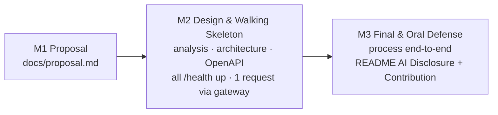

# Getting Started

> This file explains **how to use this starter**. It is not part of your deliverable — your project report is [`README.md`](README.md).
> Rules and grading: [`INSTRUCTION.md`](INSTRUCTION.md).

---

## 1. Prerequisites

| Tool | Check | Install |
|------|-------|---------|
| Git | `git --version` | https://git-scm.com/downloads |
| Docker Desktop (includes Compose v2) | `docker compose version` | https://docs.docker.com/get-docker/ |
| An AI coding assistant (optional) | — | See [`.ai/ai-guide.md`](.ai/ai-guide.md) |

> On Windows, start Docker Desktop and wait for the 🐳 icon before running any `docker` command.
> No Docker on your machine? Open the repo in **GitHub Codespaces** — the `.devcontainer/` is pre-configured.

---

## 2. Create Your Team Repository (GitHub Classroom)

1. Open the **GitHub Classroom assignment link** from your instructor (`https://classroom.github.com/a/...`).
2. Pick your name from the roster. If it is missing, **stop and contact the instructor** — never pick someone else's entry.
3. The first member **creates the team** (name: as instructed); other members **join** that team. Max 3 members.
4. Classroom creates a private repository with all starter files: `https://github.com/<org>/<assignment>-<team>`.
5. Every member clones it:

```bash
git clone https://github.com/<org>/<assignment>-<team>.git
cd <assignment>-<team>
make init        # or: cp .env.example .env
```

6. In the first week, fill in the **Team** table and **Problem & Idea** section of `README.md`.

> Do **not** fork the public starter repository — forks are public and other teams could copy your work.
> If the instructor updates the starter during the semester, they will announce what to copy over (CI tells you if `INSTRUCTION.md` is outdated).

---

## 3. Project Structure

```
├── INSTRUCTION.md          # Assignment brief & grading (read-only)
├── README.md               # Your project report (edit this)
├── AGENTS.md               # Instructions for AI assistants
├── docker-compose.yml      # All components
├── .env.example            # Every configuration variable
├── docs/
│   ├── proposal.md                 # M1
│   ├── analysis-and-design.md      # Approach 1: Step-by-Step Action   ┐ choose
│   ├── analysis-and-design-ddd.md  # Approach 2: Domain-Driven Design  ┘ one
│   ├── architecture.md             # Patterns, components, deployment
│   ├── api-specs/                  # OpenAPI 3.0 per service (+ async/gRPC guides)
│   ├── ai-log.md                   # AI usage log
│   └── asset/                      # Diagrams, screenshots
├── frontend/   gateway/            # Dockerfile + readme.md + src/
└── services/service-a/ service-b/  # Rename to your services
```

Ports: each container listens on **5000** internally (gateway 8000, frontend 3000); Compose publishes them to the
host as 5001, 5002, 8080, 3000. Containers talk to each other as `http://<service-name>:<container-port>`.

---

## 4. Workflow by Milestone



### M1 — Proposal

- [ ] Choose a domain and **one** business process (5–15 steps, 2–4 actors).
- [ ] Complete [`docs/proposal.md`](docs/proposal.md); fill in README Team and Problem & Idea. Tag `m1`.

### M2 — Design & Walking Skeleton

- [ ] Choose **one** analysis approach and complete all three parts:
  - **Step-by-Step Action** — [`docs/analysis-and-design.md`](docs/analysis-and-design.md): decompose the process into actions, group them into services.
  - **Domain-Driven Design** — [`docs/analysis-and-design-ddd.md`](docs/analysis-and-design-ddd.md): discover domain events and bounded contexts, map them to services.
- [ ] Complete [`docs/architecture.md`](docs/architecture.md) — patterns traced back to your NFRs.
- [ ] Write OpenAPI specs in [`docs/api-specs/`](docs/api-specs/) matching Part 3 contracts.
- [ ] Rename services to match your design (folders, `docker-compose.yml`, specs, readmes).
- [ ] Every component builds and starts; gateway and services answer `GET /health`; one request goes through the gateway. Tag `m2`.

### M3 — Final

- [ ] Implement the business process end-to-end, following your specs.
- [ ] Update each component's `readme.md` and the README. Tag `final`.

**Log AI usage as you go** in [`docs/ai-log.md`](docs/ai-log.md) — two minutes after each significant session is far easier than reconstructing it the night before the deadline.

---

## 5. Commands

| Command | Meaning |
|---------|---------|
| `make init` | Create `.env` from `.env.example` and check Docker |
| `make up` / `make up-d` | Build and start everything (foreground / background) |
| `make smoke` | Health-check every component that has code |
| `make logs` / `make logs-service s=service-a` | Follow logs |
| `make down` | Stop everything |
| `make clean` | Remove containers, volumes and images |

---

## 6. Team Git Workflow

```
main  ← merge via Pull Requests only
 ├── feature/order-service      (member 1)
 ├── feature/payment-service    (member 2)
 └── feature/gateway-frontend   (member 3)
```

1. `git checkout -b feature/<short-name>`
2. Commit small and often, with meaningful messages, **from your own account**.
3. Open a Pull Request — the PR template asks how you tested it and whether AI was used.
4. Another member reviews, then merge.

Split work **by service** (spec + code + data + readme), not by layer, so each member can explain a complete part in the oral defense.

---

## Submission Checklist

Before tagging `final`:

- [ ] **README:** Team, Problem & Idea, Architecture, Quick Start, Demo evidence — filled in, no template placeholders left.
- [ ] **AI Disclosure** (README §8) and [`docs/ai-log.md`](docs/ai-log.md) complete.
- [ ] **Contribution** table complete and **confirmed by every member**.
- [ ] `docs/proposal.md`, one analysis document, `docs/architecture.md` and `docs/api-specs/` complete and consistent with the code (same service names, paths, fields).
- [ ] Clean cold start works with no manual steps: `docker compose down -v && docker compose up --build`.
- [ ] Gateway and every service return `{"status": "ok"}` on `GET /health` (`make smoke`).
- [ ] The business process works end-to-end through the gateway.
- [ ] No `localhost` in inter-service calls; no secrets in code; `.env.example` lists every variable.
- [ ] Every member can explain every part they claim — see the self-check in [`.ai/ai-guide.md`](.ai/ai-guide.md#4-prepare-for-the-oral-defense).
- [ ] CI is green on `main`.
