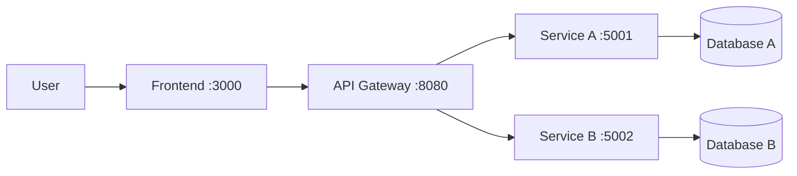

# Project Name

> **Course:** Service-Oriented Software Development · PTIT · Instructor: Dr. Hung N. Dang
>
> *One-sentence pitch: what your system does and for whom.*

📜 Assignment brief & grading: [`INSTRUCTION.md`](INSTRUCTION.md) · 🚀 Setup & workflow: [`GETTING_STARTED.md`](GETTING_STARTED.md)

> **Template note:** replace every *(italic placeholder)* below. Sections marked **(mandatory)** are required for grading.

---

## 1. Team (mandatory)

| # | Full name | Student ID | Class | GitHub | Role |
|:-:|-----------|:----------:|:-----:|--------|------|
| 1 | | | | @ | |
| 2 | | | | @ | |
| 3 | | | | @ | |

**Business process:** *(e.g., "Customer places a food order and receives delivery")*

---

## 2. Problem & Idea (mandatory)

- **Problem:** *(What problem are you solving? Who has it?)*
- **Our idea:** *(Your solution in 2–3 sentences.)*
- **Actors & scope:** *(Who takes part; where the process starts and ends.)*
- **What makes it non-trivial:** *(e.g., a multi-service transaction, availability limits, async notifications.)*
- **Out of scope:** *(What you deliberately do not build.)*

Full proposal: [`docs/proposal.md`](docs/proposal.md)

---

## 3. Features

- [ ] *(Process step / capability 1)*
- [ ] *(Process step / capability 2)*
- [ ] *(Process step / capability 3)*

---

## 4. Architecture



| Component | Responsibility | Tech stack | Host port | Owner |
|-----------|----------------|------------|:---------:|-------|
| Frontend | | | 3000 | |
| Gateway | | | 8080 | |
| *(Service A — rename)* | | | 5001 | |
| *(Service B — rename)* | | | 5002 | |

Details: [`docs/architecture.md`](docs/architecture.md) · API contracts: [`docs/api-specs/`](docs/api-specs/)

---

## 5. Quick Start

```bash
cp .env.example .env            # or: make init
docker compose up --build       # or: make up
make smoke                      # health checks of all components
```

*(Add how to open the frontend and run through the business process.)*

---

## 6. Demo & Evidence

*(Screenshots or request/response logs of the business process end-to-end. Put images in `docs/asset/`.)*

---

## 7. Documentation

| Document | Content |
|----------|---------|
| [`docs/proposal.md`](docs/proposal.md) | M1 — problem, idea, scope, plan |
| [`docs/analysis-and-design.md`](docs/analysis-and-design.md) **or** [`docs/analysis-and-design-ddd.md`](docs/analysis-and-design-ddd.md) | Analysis & service design (one approach) |
| [`docs/architecture.md`](docs/architecture.md) | Patterns, components, communication, deployment |
| [`docs/api-specs/`](docs/api-specs/) | OpenAPI 3.0 specifications |
| [`docs/ai-log.md`](docs/ai-log.md) | AI usage log |

---

## 8. AI Disclosure (mandatory)

> Policy: [`INSTRUCTION.md` §7](INSTRUCTION.md#7-ai-usage-policy). Disclosing AI use never lowers your score — hiding it does.

### 8.1 Summary

| Tool / model | Used by | Used for | Files / modules | Level |
|--------------|---------|----------|-----------------|-------|
| *(e.g., Claude)* | *(member)* | *(e.g., draft OpenAPI spec, review service decomposition)* | *(paths)* | *(Assist / Co-write / Generated)* |

**Levels:** **Assist** — explanations, suggestions, review; we wrote the code. **Co-write** — AI drafted parts, we
substantially rewrote. **Generated** — AI wrote most of it; we reviewed, tested and can explain it.

### 8.2 Decisions we made ourselves

*(Key design decisions made by the team, possibly after comparing AI-suggested options. E.g., "Merged Menu and
Restaurant into one service because they always change together in our process.")*

### 8.3 Where AI was wrong — and how we found out

*(At least one concrete example: a bug, wrong assumption or bad design from AI, and how you detected and fixed it.)*

### 8.4 Full log

See [`docs/ai-log.md`](docs/ai-log.md).

---

## 9. Contribution (mandatory)

| Member | Owns (modules / documents) | Key PRs / commits | AI-assisted parts | Contribution % |
|--------|----------------------------|-------------------|-------------------|:--------------:|
| | *(e.g., `services/order-service/`, `docs/api-specs/order-service.yaml`)* | *(e.g., #3, #7)* | *(e.g., gateway routing — Generated)* | |
| | | | | |
| | | | | |

We confirm the table above is accurate and agreed by all members:

- [ ] Member 1
- [ ] Member 2
- [ ] Member 3

---

<sub>Based on the [microservices-assignment-starter](https://github.com/hungdn1701/microservices-assignment-starter) template by Hung N. Dang.</sub>
