# 📊 Hệ thống Microservices - Phân tích và Thiết kế

Tài liệu này trình bày **phân tích** và **thiết kế** hệ thống quản lý y tế dựa trên kiến trúc microservices.

---

## 1. 🎯 Bài toán

Hệ thống quản lý y tế cung cấp nền tảng thống nhất kết nối bệnh nhân, nhân viên y tế và quản trị viên để:

- **Người dùng**:
  - Bệnh nhân, Bác sĩ, Y tá, Dược sĩ, Kỹ thuật viên xét nghiệm, Nhà cung cấp bảo hiểm, Quản trị viên
- **Mục tiêu chính**:
  - Truy cập bảo mật theo vai trò (RBAC)
  - Đặt lịch và quản lý cuộc hẹn đơn giản
  - Quản lý hồ sơ y tế điện tử toàn diện
  - Xử lý đơn thuốc và kiểm soát tồn kho
  - Quản lý yêu cầu và kết quả xét nghiệm
  - Tạo hóa đơn và xử lý bồi thường bảo hiểm tự động
  - Gửi thông báo thời gian thực và bất đồng bộ
- **Dữ liệu xử lý**:
  - Thông tin người dùng và xác thực
  - Lịch hẹn và thời gian làm việc bác sĩ
  - Hồ sơ y tế, các phiên khám và chẩn đoán
  - Đơn thuốc và tồn kho thuốc
  - Yêu cầu xét nghiệm, mẫu và kết quả
  - Hóa đơn, giao dịch thanh toán, yêu cầu bảo hiểm
  - Nhật ký audit và hoạt động hệ thống

## 1.1 👤 Các tác nhân (Actors)

Hệ thống phục vụ nhiều đối tượng người dùng khác nhau, mỗi đối tượng có vai trò và trách nhiệm riêng:

### Bệnh nhân
- Đăng ký và đăng nhập vào hệ thống
- Đặt và hủy lịch hẹn khám
- Xem hồ sơ y tế cá nhân
- Nhận và xem đơn thuốc
- Thanh toán viện phí
- Xem kết quả xét nghiệm
- Cập nhật thông tin cá nhân

### Bác sĩ
- Quản lý lịch hẹn và thời gian làm việc
- Truy cập và xem hồ sơ bệnh án của bệnh nhân
- Chẩn đoán và kê đơn điều trị
- Yêu cầu xét nghiệm
- Viết báo cáo y khoa
- Xem kết quả xét nghiệm
- Trao đổi với bệnh nhân và nhân viên y tế khác

### Điều dưỡng (Y tá)
- Hỗ trợ chăm sóc bệnh nhân
- Ghi nhận và cập nhật chỉ số sinh tồn
- Phát thuốc theo chỉ định
- Hỗ trợ bác sĩ trong chẩn đoán và điều trị
- Cập nhật hồ sơ bệnh nhân

### Quản trị viên
- Quản lý người dùng và phân quyền
- Đảm bảo an ninh và tuân thủ quy định
- Lập lịch làm việc cho nhân sự
- Quản lý thanh toán và bảo hiểm
- Tạo báo cáo và phân tích
- Quản lý trang thiết bị, tài nguyên

### Dược sĩ
- Duyệt và cấp phát thuốc
- Quản lý tồn kho dược
- Xử lý đơn thuốc
- Liên lạc với bác sĩ và bệnh nhân

### Nhà cung cấp bảo hiểm
- Xác minh thông tin bảo hiểm
- Xử lý yêu cầu bồi thường
- Thông báo với bệnh nhân và quản trị viên
- Phê duyệt/từ chối yêu cầu bảo hiểm

### Kỹ thuật viên xét nghiệm
- Thực hiện xét nghiệm
- Tải kết quả lên hệ thống
- Thông báo cho bác sĩ và bệnh nhân
- Bảo trì thiết bị xét nghiệm và dữ liệu

---

## 1.2 💻 Các trường hợp sử dụng (Use Cases)

Hệ thống được thiết kế để hỗ trợ các trường hợp sử dụng chính sau:

### Quản lý bệnh nhân
- Đăng ký/Đăng nhập: Bệnh nhân đăng ký tài khoản mới hoặc đăng nhập vào hệ thống
- Xem hồ sơ y tế: Bệnh nhân xem lịch sử khám bệnh, chẩn đoán, điều trị
- Đặt/hủy lịch hẹn: Bệnh nhân đặt lịch hẹn với bác sĩ hoặc hủy lịch hẹn đã đặt
- Xem đơn thuốc: Bệnh nhân xem đơn thuốc được kê và hướng dẫn sử dụng
- Thanh toán viện phí: Bệnh nhân thanh toán các chi phí khám chữa bệnh

### Chức năng của bác sĩ
- Lên lịch và quản lý lịch hẹn: Bác sĩ thiết lập thời gian rảnh và quản lý lịch hẹn
- Truy cập lịch sử bệnh án: Bác sĩ xem hồ sơ y tế của bệnh nhân
- Chẩn đoán và kê đơn: Bác sĩ chẩn đoán bệnh và kê đơn điều trị
- Yêu cầu xét nghiệm: Bác sĩ yêu cầu các xét nghiệm cần thiết
- Viết báo cáo y khoa: Bác sĩ viết báo cáo về tình trạng bệnh nhân

### Quản lý dược phẩm
- Duyệt và cấp phát đơn thuốc: Dược sĩ kiểm tra và cấp phát thuốc theo đơn
- Quản lý tồn kho: Dược sĩ quản lý số lượng thuốc trong kho
- Xử lý thanh toán: Dược sĩ xử lý thanh toán cho đơn thuốc

### Quản trị bệnh viện
- Quản lý người dùng và phân quyền: Quản trị viên quản lý tài khoản và quyền truy cập
- Lập lịch làm việc: Quản trị viên lập lịch làm việc cho bác sĩ và điều dưỡng
- Quản lý thanh toán và bảo hiểm: Quản trị viên xử lý các vấn đề về thanh toán và bảo hiểm

### Quản lý xét nghiệm
- Thực hiện xét nghiệm: Kỹ thuật viên tiến hành các xét nghiệm y tế
- Tải kết quả xét nghiệm: Kỹ thuật viên cập nhật kết quả lên hệ thống
- Thông báo kết quả: Hệ thống thông báo cho bác sĩ và bệnh nhân về kết quả xét nghiệm

## 1.3 📊 Chức năng theo tác nhân

Bảng dưới đây tổng hợp các chức năng chính của hệ thống theo từng tác nhân:

| Tác nhân | Chức năng chính |
|---------|-------------|
| **Bệnh nhân** | - Đăng ký/Đăng nhập<br>- Đặt/Hủy lịch hẹn<br>- Xem hồ sơ y tế<br>- Nhận đơn thuốc<br>- Thanh toán viện phí<br>- Xem kết quả xét nghiệm<br>- Cập nhật thông tin cá nhân |
| **Bác sĩ** | - Quản lý lịch hẹn<br>- Truy cập hồ sơ bệnh nhân<br>- Chẩn đoán & kê đơn<br>- Yêu cầu xét nghiệm<br>- Viết báo cáo y khoa<br>- Xem kết quả xét nghiệm<br>- Trao đổi với bệnh nhân & nhân viên |
| **Điều dưỡng** | - Hỗ trợ chăm sóc bệnh nhân<br>- Ghi nhận chỉ số sinh tồn<br>- Phát thuốc theo chỉ định<br>- Hỗ trợ bác sĩ trong chẩn đoán & điều trị<br>- Cập nhật hồ sơ bệnh nhân |
| **Quản trị viên** | - Quản lý người dùng & phân quyền<br>- Đảm bảo an ninh & tuân thủ<br>- Lập lịch làm việc cho nhân sự<br>- Quản lý thanh toán & bảo hiểm<br>- Tạo báo cáo & phân tích<br>- Quản lý trang thiết bị, tài nguyên |
| **Dược sĩ** | - Duyệt & cấp phát thuốc<br>- Quản lý tồn kho dược<br>- Xử lý đơn thuốc<br>- Liên lạc với bác sĩ & bệnh nhân |
| **Nhà cung cấp bảo hiểm** | - Xác minh thông tin bảo hiểm<br>- Xử lý yêu cầu bồi thường<br>- Thông báo với bệnh nhân & quản trị viên<br>- Phê duyệt/từ chối yêu cầu bảo hiểm |
| **Kỹ thuật viên xét nghiệm** | - Thực hiện xét nghiệm<br>- Tải kết quả lên hệ thống<br>- Thông báo cho bác sĩ & bệnh nhân<br>- Bảo trì thiết bị xét nghiệm & dữ liệu |

---

## 2. 🧩 Các Microservices

| Service Name           | Trách nhiệm                                                      | Công nghệ                                  |
|------------------------|------------------------------------------------------------------|--------------------------------------------|
| User Service           | Xác thực, phân quyền, quản lý hồ sơ và ghi nhật ký audit         | Django, DRF, PostgreSQL, JWT, Celery       |
| Medical Record Service | Quản lý hồ sơ, phiên khám, chẩn đoán, điều trị, dị ứng          | Django, DRF, PostgreSQL, Celery            |
| Appointment Service    | Quản lý thời gian làm việc, khung giờ, cuộc hẹn                  | Django, DRF, PostgreSQL, Celery            |
| Pharmacy Service       | Quản lý đơn thuốc, kê đơn, tồn kho, chi tiết kê đơn              | Django, DRF, PostgreSQL, Celery            |
| Laboratory Service     | Quản lý yêu cầu xét nghiệm, lấy mẫu, kết quả, thông báo          | Django, DRF, PostgreSQL, Celery, Channels  |
| Billing Service        | Tạo hóa đơn, thanh toán, yêu cầu bảo hiểm                        | Django, DRF, PostgreSQL, Celery            |
| Notification Service   | Xử lý tác vụ bất đồng bộ và thông báo thời gian thực             | Django, DRF, PostgreSQL, Celery, Channels  |
| API Gateway            | Định tuyến, bảo mật, rate limiting, quản lý token               | Node.js, Express, http-proxy-middleware    |
| Frontend Service       | Giao diện Web/Mobile                                             | React, TypeScript                          |
| Common Auth Library    | Chia sẻ mã xác thực, permission, health-check                   | Python package                             |

---

## 3. 🔄 Giao tiếp giữa các dịch vụ

- **API Gateway**:
  - Xử lý JWT, CORS, rate limit và logging trong `api-gateway/src/app.js` (helmet, cors, morgan).
  - Middleware `sessionMiddleware` & `tokenRefreshMiddleware` kiểm tra và refresh token.
  - Proxy trong `api-gateway/src/services/proxy.js` giữ header `Authorization` và thêm `X-User-ID`, `X-User-Role`,... từ `req.user`.

- **REST HTTP**:
  - Các service Django expose `/api/...` theo định nghĩa trong `*/core/urls.py` và module tương ứng.
  - Gọi HTTP đồng bộ với header `Authorization: Bearer <token>`.

- **Event-Driven (Celery + Redis)**:
  - Task bất đồng bộ (nhắc lịch, email/SMS) định nghĩa trong `notification/tasks.py`, cấu hình tại `core/celery.py`.
  - Broker Redis (`CELERY_BROKER_URL`), chạy worker:
    ```bash
    celery -A core.celery worker --loglevel=info
    ```

- **Real-time (WebSocket)**:
  - ASGI config tại `core/asgi.py` với Django Channels & Daphne.
  - Routing trong `notification/routing.py`, consumer tại `notification/consumers.py`:
    ```python
    class NotificationConsumer(AsyncWebsocketConsumer):
        async def connect(self):
            self.user_id = self.scope['url_route']['kwargs']['user_id']
            await self.channel_layer.group_add(self.user_id, self.channel_name)
            await self.accept()
    ```

- **Propagate Context**:
  - Gateway attach `req.user`, downstream services dùng header `X-User-ID`, `X-User-Role`, `X-User-Email`,... để phân quyền.

---

## 4. 🗂️ Thiết kế dữ liệu

Mỗi service quản lý database PostgreSQL riêng. Dưới đây là các sơ đồ Entity Relationship Diagram (ERD) mô tả cấu trúc dữ liệu của từng service.

### 4.1 Entity Relationship Diagram - User Service


Sơ đồ ERD mô tả cấu trúc dữ liệu của User Service, bao gồm các bảng và mối quan hệ giữa chúng.

### 4.2 Entity Relationship Diagram - Medical Record Service


Sơ đồ ERD mô tả cấu trúc dữ liệu của Medical Record Service, bao gồm các bảng và mối quan hệ giữa chúng.

### 4.3 Entity Relationship Diagram - Appointment Service


Sơ đồ ERD mô tả cấu trúc dữ liệu của Appointment Service, bao gồm các bảng và mối quan hệ giữa chúng.

### 4.4 Entity Relationship Diagram - Pharmacy Service


Sơ đồ ERD mô tả cấu trúc dữ liệu của Pharmacy Service, bao gồm các bảng và mối quan hệ giữa chúng.

### 4.5 Entity Relationship Diagram - Laboratory Service


Sơ đồ ERD mô tả cấu trúc dữ liệu của Laboratory Service, bao gồm các bảng và mối quan hệ giữa chúng.

### 4.6 Entity Relationship Diagram - Billing Service


Sơ đồ ERD mô tả cấu trúc dữ liệu của Billing Service, bao gồm các bảng và mối quan hệ giữa chúng.

### 4.7 Entity Relationship Diagram - Notification Service


Sơ đồ ERD mô tả cấu trúc dữ liệu của Notification Service, bao gồm các bảng và mối quan hệ giữa chúng.

---

## 5. 🔐 Bảo mật

- **Xác thực**: JWT (Access token 1h, Refresh token 7d), blacklist token khi logout.
- **Phân quyền**: RBAC (Admin, Doctor, Nurse, Patient, Pharmacist, LabTech, Insurance).
- **Truyền tải**: HTTPS/TLS cho mọi giao tiếp.
- **Validate**: Kiểm tra input và permission object-level.
- **Audit**: Ghi nhật ký hoạt động người dùng.

---

## 6. 📦 Triển khai

- Docker Compose orchestrate tất cả dịch vụ.
- Mỗi service có `Dockerfile` riêng; common-auth cài `pip install -e services/common-auth/`.
- Biến môi trường (`.env`) cho secrets và URL service.
- Health checks: PostgreSQL (`pg_isready`), Redis (`redis-cli ping`).
- Frontend build với `npm run build`, deploy qua Nginx hoặc `npm start` dev.

---

## 7. 📊 Cấu trúc tĩnh của hệ thống

### 7.0 Class Diagram - Tổng quan hệ thống

Sơ đồ class tổng quan mô tả cấu trúc tĩnh của toàn bộ hệ thống, bao gồm các lớp chính và mối quan hệ giữa chúng:


### 7.1 Class Diagram - User Service

Sơ đồ class mô tả cấu trúc tĩnh của User Service, bao gồm các lớp, thuộc tính, phương thức và mối quan hệ giữa chúng:


### 7.2 Class Diagram - Medical Record Service

Sơ đồ class mô tả cấu trúc tĩnh của Medical Record Service, bao gồm các lớp, thuộc tính, phương thức và mối quan hệ giữa chúng:


### 7.3 Class Diagram - Appointment Service

Sơ đồ class mô tả cấu trúc tĩnh của Appointment Service, bao gồm các lớp, thuộc tính, phương thức và mối quan hệ giữa chúng:


### 7.4 Class Diagram - Pharmacy Service

Sơ đồ class mô tả cấu trúc tĩnh của Pharmacy Service, bao gồm các lớp, thuộc tính, phương thức và mối quan hệ giữa chúng:


### 7.5 Class Diagram - Laboratory Service

Sơ đồ class mô tả cấu trúc tĩnh của Laboratory Service, bao gồm các lớp, thuộc tính, phương thức và mối quan hệ giữa chúng:


### 7.6 Class Diagram - Billing Service

Sơ đồ class mô tả cấu trúc tĩnh của Billing Service, bao gồm các lớp, thuộc tính, phương thức và mối quan hệ giữa chúng:


### 7.7 Class Diagram - Notification Service

Sơ đồ class mô tả cấu trúc tĩnh của Notification Service, bao gồm các lớp, thuộc tính, phương thức và mối quan hệ giữa chúng:


## 8. 🎨 Sơ đồ kiến trúc

### 8.1 Kiến trúc tổng quan

Sơ đồ dưới đây mô tả kiến trúc tổng quan của hệ thống, bao gồm các thành phần chính và cách chúng tương tác với nhau:

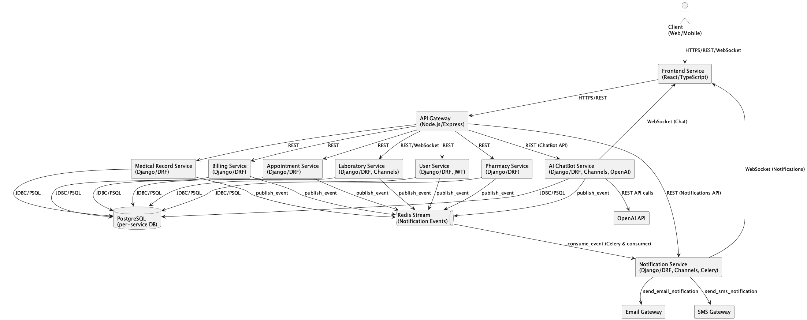

### 8.2 Use Case

Sơ đồ use case mô tả các tác nhân và chức năng chính của hệ thống:

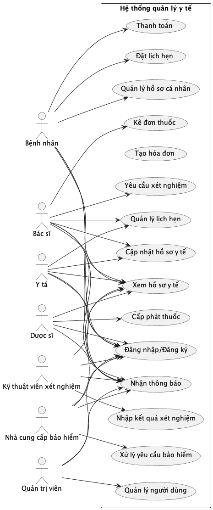

### 8.3 Luồng đặt lịch hẹn

Sơ đồ sequence mô tả chi tiết luồng đặt lịch hẹn:

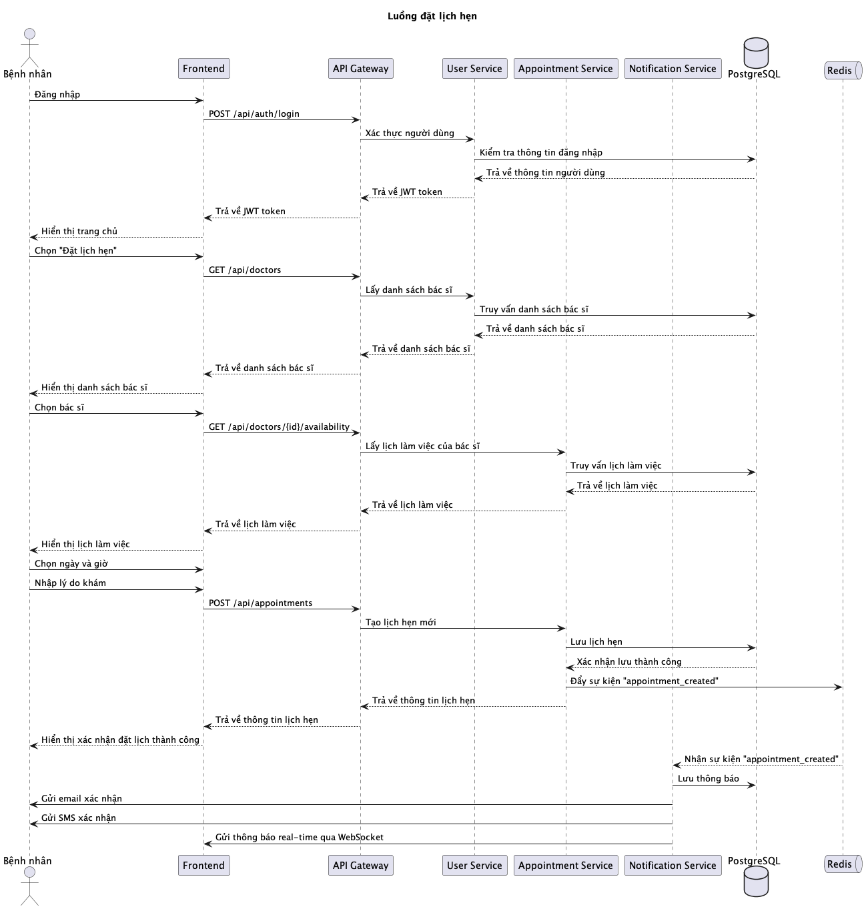

### 8.4 Luồng kê đơn thuốc

Sơ đồ sequence mô tả chi tiết luồng kê đơn thuốc:

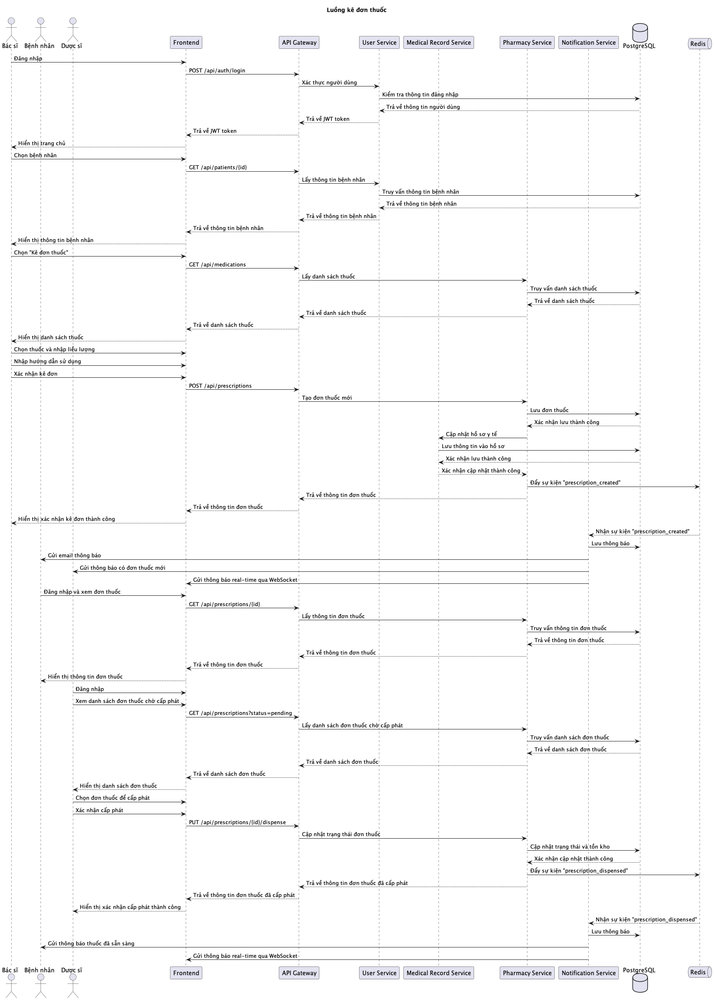

### 8.5 Luồng yêu cầu xét nghiệm

Sơ đồ sequence mô tả chi tiết luồng yêu cầu xét nghiệm:

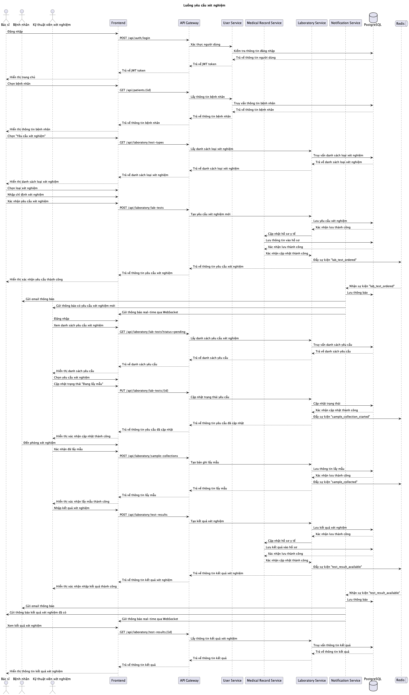

### 8.6 Các quy trình chính (Main Workflows)

Hệ thống hỗ trợ các quy trình nghiệp vụ chính sau:

#### 1. Bệnh nhân đặt lịch hẹn khám

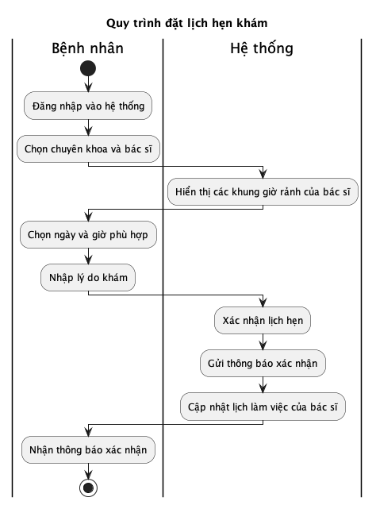

- Bệnh nhân đăng nhập vào hệ thống
- Bệnh nhân chọn chuyên khoa và bác sĩ
- Hệ thống hiển thị các khung giờ rảnh của bác sĩ
- Bệnh nhân chọn ngày và giờ phù hợp
- Bệnh nhân nhập lý do khám
- Hệ thống xác nhận lịch hẹn và gửi thông báo

#### 2. Bác sĩ chẩn đoán và kê đơn điều trị

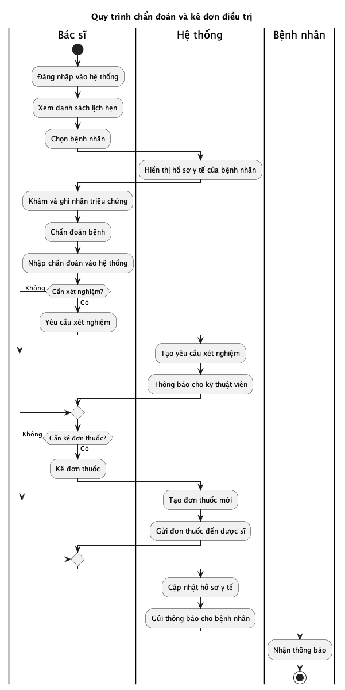

- Bác sĩ đăng nhập và xem danh sách lịch hẹn
- Bác sĩ chọn bệnh nhân và xem hồ sơ y tế
- Bác sĩ khám và ghi nhận triệu chứng
- Bác sĩ chẩn đoán bệnh và nhập vào hệ thống
- Bác sĩ kê đơn thuốc hoặc yêu cầu xét nghiệm
- Hệ thống cập nhật hồ sơ y tế và gửi thông báo

#### 3. Kỹ thuật viên thực hiện và tải kết quả xét nghiệm

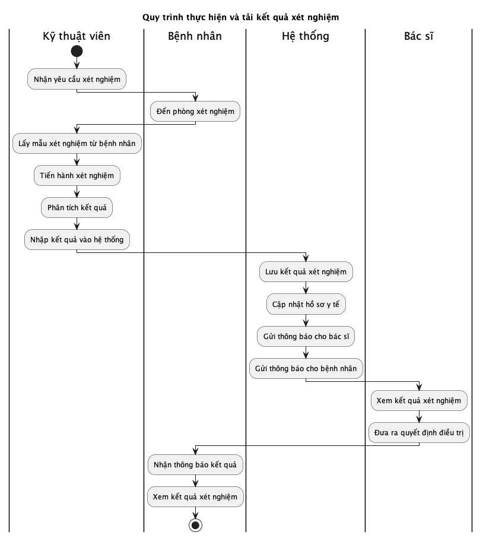

- Kỹ thuật viên nhận yêu cầu xét nghiệm
- Kỹ thuật viên lấy mẫu xét nghiệm từ bệnh nhân
- Kỹ thuật viên tiến hành xét nghiệm
- Kỹ thuật viên nhập kết quả vào hệ thống
- Hệ thống thông báo cho bác sĩ và bệnh nhân

#### 4. Dược sĩ cấp phát thuốc

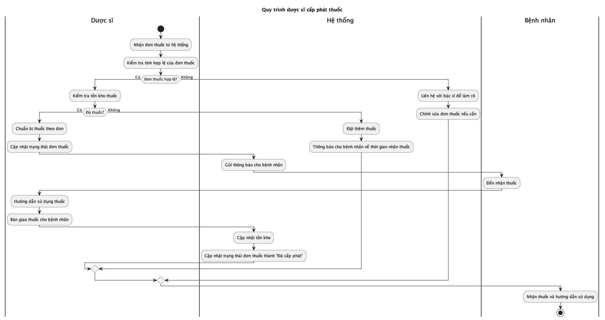

- Dược sĩ nhận đơn thuốc từ hệ thống
- Dược sĩ kiểm tra tính hợp lệ của đơn thuốc
- Dược sĩ kiểm tra tồn kho thuốc
- Dược sĩ chuẩn bị thuốc theo đơn
- Dược sĩ cập nhật trạng thái đơn thuốc
- Bệnh nhân nhận thuốc và hướng dẫn sử dụng

#### 5. Quản trị viên quản lý vai trò người dùng

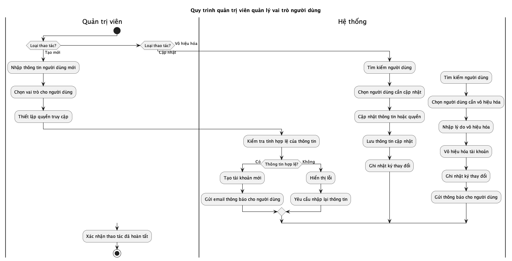

- Quản trị viên tạo tài khoản mới
- Quản trị viên gán vai trò và quyền cho người dùng
- Quản trị viên cập nhật thông tin người dùng
- Quản trị viên vô hiệu hóa tài khoản khi cần

#### 6. Nhà cung cấp bảo hiểm xử lý yêu cầu bồi thường

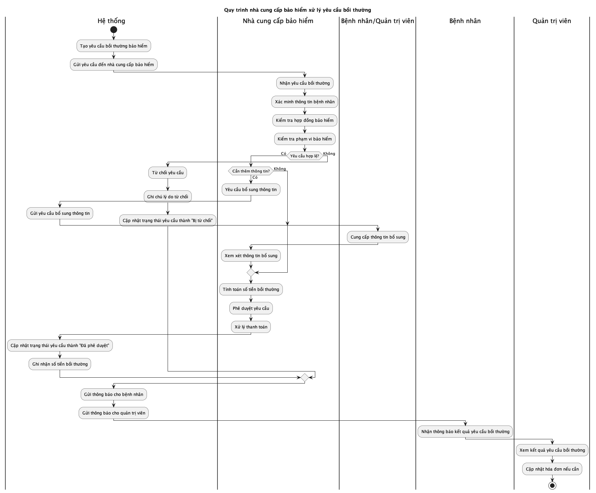

- Hệ thống gửi yêu cầu bồi thường đến nhà cung cấp bảo hiểm
- Nhà cung cấp bảo hiểm xác minh thông tin bệnh nhân
- Nhà cung cấp bảo hiểm kiểm tra phạm vi bảo hiểm
- Nhà cung cấp bảo hiểm phê duyệt hoặc từ chối yêu cầu
- Hệ thống cập nhật trạng thái yêu cầu bảo hiểm
- Hệ thống thông báo cho bệnh nhân và quản trị viên

**Chú thích**: US=User Service, MR=Medical Record Service, APPT=Appointment Service, PHA=Pharmacy Service, LAB=Laboratory Service, BILL=Billing Service, NOTIF=Notification Service

---

## 8. 🤖 AI ChatBot Service

AI ChatBot Service nâng cao chăm sóc bệnh nhân và giao tiếp thông qua hai thành phần chính:

### 8.1 OpenAI-Powered Health Assistant

**Mục đích**: Cung cấp hỗ trợ tuyến đầu 24/7 cho các câu hỏi sức khỏe chung và hướng dẫn sử dụng hệ thống

**Tính năng**:
- Thông tin và hướng dẫn sức khỏe sử dụng ChatGPT API
- Hỗ trợ đặt lịch hẹn
- Nhắc nhở và thông tin về thuốc
- Hướng dẫn sử dụng hệ thống
- Đánh giá sơ bộ triệu chứng
- Trả lời các câu hỏi thường gặp về chăm sóc sức khỏe

### 8.2 Patient-Doctor Secure Chat

**Mục đích**: Cho phép giao tiếp trực tiếp, an toàn giữa bệnh nhân và nhà cung cấp dịch vụ chăm sóc sức khỏe

**Tính năng**:
- Nhắn tin thời gian thực giữa bệnh nhân và bác sĩ
- Chia sẻ file và hình ảnh cho tài liệu y tế
- Lưu trữ lịch sử trò chuyện trong hồ sơ y tế
- Thông báo tự động cho tin nhắn mới
- Mã hóa tin nhắn để bảo mật
- Phân loại tin nhắn (khẩn cấp/không khẩn cấp)

### 8.3 Triển khai kỹ thuật

**Kiến trúc dịch vụ**:

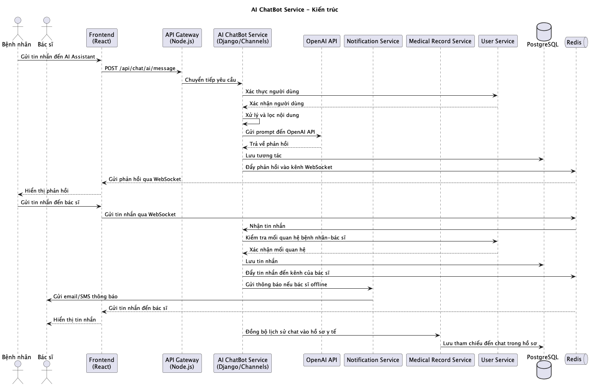

- ChatBot Service:
  - Xử lý cả trợ lý AI và nhắn tin trực tiếp
  - Duy trì lịch sử trò chuyện và hàng đợi tin nhắn
  - Tích hợp với OpenAI API

**Cơ sở dữ liệu**:

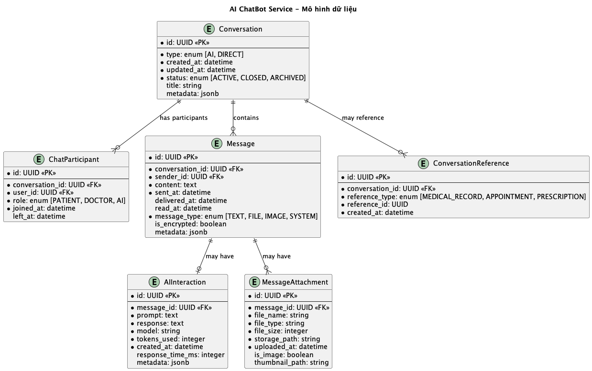

- `Conversations`: Bản ghi phiên trò chuyện
- `Messages`: Nội dung tin nhắn riêng lẻ
- `AIInteractions`: Nhật ký tương tác ChatGPT
- `ChatParticipants`: Mối quan hệ trò chuyện người dùng
- `MessageAttachments`: File/hình ảnh được chia sẻ
- `ConversationReference`: Tham chiếu đến hồ sơ y tế, lịch hẹn, đơn thuốc

**Luồng giao tiếp**:

*Luồng trợ lý AI*:
1. Bệnh nhân bắt đầu trò chuyện AI
2. Dịch vụ xử lý đầu vào thông qua bộ lọc nội dung
3. Nội dung đã lọc được gửi đến OpenAI API
4. Phản hồi được xác thực và gửi đến bệnh nhân
5. Tương tác được ghi lại để đảm bảo chất lượng

*Luồng trò chuyện bệnh nhân-bác sĩ*:
1. Bệnh nhân chọn bác sĩ từ đội ngũ chăm sóc của họ
2. Kết nối WebSocket thời gian thực được thiết lập
3. Tin nhắn được mã hóa đầu-cuối
4. Thông báo được gửi qua Notification Service
5. Lịch sử trò chuyện được đồng bộ với Medical Records

**Các vấn đề bảo mật**:
- Mã hóa đầu-cuối cho tất cả tin nhắn
- Xử lý và xác thực prompt AI
- Tuân thủ PHI (Protected Health Information)
- Kiểm soát truy cập dựa trên mối quan hệ bác sĩ-bệnh nhân
- Chính sách lưu giữ tin nhắn
- Ghi nhật ký kiểm toán cho tất cả tương tác

**Điểm tích hợp**:
- User Service: Xác thực và mối quan hệ người dùng
- Medical Record Service: Lưu trữ lịch sử trò chuyện
- Appointment Service: Đặt lịch thông qua trò chuyện
- Notification Service: Thông báo trò chuyện và nhắc nhở
- OpenAI API: Khả năng trợ lý AI

**API Endpoints**:
- `/api/chat/ai/start`: Khởi tạo phiên trò chuyện AI
- `/api/chat/ai/message`: Gửi tin nhắn đến AI
- `/api/chat/direct/start`: Bắt đầu trò chuyện bác sĩ-bệnh nhân
- `/api/chat/direct/message`: Gửi tin nhắn trực tiếp
- `/api/chat/history`: Lấy lịch sử trò chuyện
- `/api/chat/attachments`: Xử lý tải lên file

**Yêu cầu triển khai**:
- Hỗ trợ WebSocket trong API Gateway
- Redis cho hàng đợi tin nhắn thời gian thực
- Cơ sở dữ liệu riêng cho lưu trữ trò chuyện
- Quản lý thông tin xác thực OpenAI API
- Lưu trữ file có khả năng mở rộng cho tệp đính kèm

---

## ✅ Kết luận

Kiến trúc microservices đảm bảo phân tách rõ ràng, dễ mở rộng độc lập, an toàn và linh hoạt cho yêu cầu ngành y tế. Dịch vụ AI ChatBot mới bổ sung khả năng hỗ trợ tự động và kênh giao tiếp trực tiếp, cải thiện khả năng tiếp cận chăm sóc bệnh nhân và hiệu quả cho nhà cung cấp dịch vụ.

---
