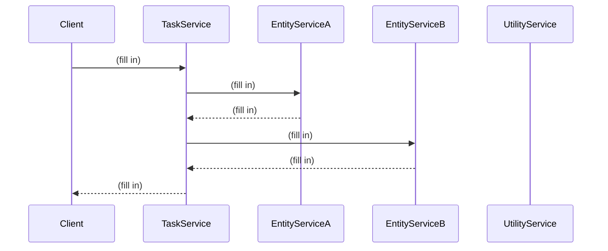
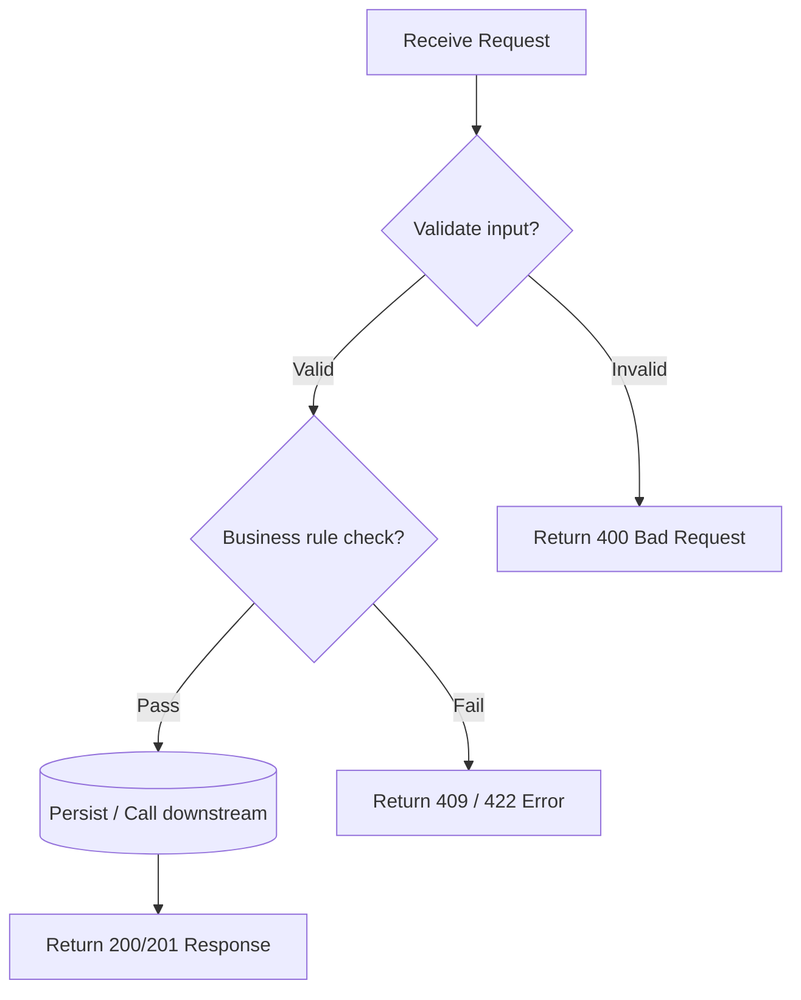

# Analysis and Design — Step-by-Step Action Approach

> **Goal**: Analyze a specific business process and design a service-oriented automation solution (SOA/Microservices).
> **Scope**: 4–6 week assignment — focus on **one business process**, not an entire system.
>
> **Alternative to**: [`analysis-and-design-ddd.md`](analysis-and-design-ddd.md) (Domain-Driven Design approach).
> Choose **one** approach, not both. Use this if your team prefers discovering service boundaries through **decomposing concrete actions** rather than domain modeling.

**References:**
1. *Service-Oriented Architecture: Analysis and Design for Services and Microservices* — Thomas Erl (2nd Edition)
2. *Microservices Patterns: With Examples in Java* — Chris Richardson
3. *Bài tập — Phát triển phần mềm hướng dịch vụ* — Hung Dang (available in Vietnamese)

---

### How Step-by-Step Action differs from DDD

| | Step-by-Step Action (this document) | DDD |
|---|---|---|
| **Thinking direction** | Bottom-up: actions → group → service | Dual: top-down framing + bottom-up Event Storming |
| **Service boundary decided by** | Similarity of actions/functions | Semantic boundary of business domain |
| **Best suited for** | Small–medium systems, clearer technical scope | Complex business logic, multiple subdomains |
| **Key risk** | Services may be fragmented by technical logic | Requires deep domain understanding upfront |

Both approaches lead to a list of services with clear responsibilities. This approach is more structured and mechanical — useful when your team understands *what the system does* better than *what the business domain is*.

### Progression Overview

| Step | What you do | Output |
|------|------------|--------|
| **1.1** | Define the Business Process | Process diagram, actors, scope |
| **1.2** | Survey existing systems | System inventory |
| **1.3** | State non-functional requirements | NFR table |
| **2.1–2.2** | Decompose process & filter unsuitable actions | Filtered action list |
| **2.3** | Group reusable actions → Entity Service Candidates | Entity service table |
| **2.4** | Group process-specific actions → Task Service Candidate | Task service table |
| **2.5** | Map entities to REST Resources | Resource URI table |
| **2.6** | Associate capabilities with resources and HTTP methods | **Service capabilities → API endpoints** |
| **2.7** | Identify cross-cutting / high-autonomy candidates | Utility / Microservice Candidates |
| **2.8** | Show how services collaborate | Service composition diagram |
| **3.1** | Specify service contracts | OpenAPI endpoint tables |
| **3.2** | Design internal service logic | Flowchart per service |

---

## Part 1 — Analysis Preparation

### 1.1 Business Process Definition

Describe the **one** business process your team will automate. Keep scope realistic for 4–6 weeks.

- **Domain**: *(e.g., Online Food Delivery, University Course Registration, ...)*
- **Business Process**: *(e.g., "Customer places an order and receives delivery")*
- **Actors**: *(e.g., Customer, Restaurant Owner, Delivery Driver)*
- **Scope**: *(e.g., "From order placement to delivery confirmation — excluding payment settlement")*

**Process Diagram:**

*(Insert BPMN, flowchart, or image into `docs/asset/` and reference here)*

> 💡 **Tip:** A good scope for this assignment is a process with 5–15 steps and 2–4 actors. If your process has more than 20 steps, narrow the scope.

### 1.2 Existing Automation Systems

List existing systems, databases, or legacy logic related to this process.

| System Name | Type | Current Role | Interaction Method |
|-------------|------|--------------|-------------------|
|             |      |              |                   |

> If none exist, state: *"None — the process is currently performed manually."*

### 1.3 Non-Functional Requirements

Non-functional requirements serve as input in two places:
- **2.7** — justifying Utility Service and Microservice Candidates
- **`docs/architecture.md` Section 1** — justifying architectural pattern choices (e.g., high availability → Circuit Breaker, scalability → Database per Service)

| Requirement    | Description |
|----------------|-------------|
| Performance    |             |
| Security       |             |
| Scalability    |             |
| Availability   |             |

---

## Part 2 — REST/Microservices Modeling

### 2.1 Decompose Business Process & 2.2 Filter Unsuitable Actions

Decompose the process from 1.1 into granular actions. Mark actions unsuitable for service encapsulation.

> 💡 **How to do it:** Walk through your process diagram step by step. For each step, write one or more actions the system needs to perform. Then ask: *"Can this action be encapsulated as a reusable service call?"* If it requires irreducible human judgment or is a one-time manual task, mark it ❌.

| # | Action | Actor | Description | Suitable? |
|---|--------|-------|-------------|-----------|
| *(e.g., 1)* | *(e.g., SubmitOrder)* | *(e.g., Customer)* | *(e.g., Customer submits order with items and delivery address)* | ✅ |
| *(e.g., 2)* | *(e.g., Taste-test food)* | *(e.g., Chef)* | *(e.g., Chef manually approves dish quality)* | ❌ |
|   |        |       |             | ✅ / ❌    |

> ⚠️ **Common mistake:** Marking everything ✅ or ❌. A typical 10-step process has 1–3 unsuitable actions. If you have none, reconsider whether any step truly requires human judgment.

> Actions marked ❌ are excluded from further steps. Document the reason in the Description column.

### 2.3 Entity Service Candidates

Identify business entities and group reusable (agnostic) actions into Entity Service Candidates.

> 💡 **How to do it:** Look at the ✅ actions from 2.1–2.2. Ask: *"Which business entity does this action primarily read or modify?"* Actions that operate on the same entity are grouped together. Each group becomes an **Entity Service Candidate**.
>
> An action is **agnostic** (entity-level) if it is potentially reusable across multiple business processes — e.g., "GetCustomer" could be called from order, support, and billing processes.

| Entity | Service Candidate | Agnostic Actions |
|--------|-------------------|------------------|
| *(e.g., Order)* | *(e.g., order-service)* | *(e.g., CreateOrder, GetOrder, CancelOrder)* |
| *(e.g., Customer)* | *(e.g., customer-service)* | *(e.g., GetCustomer, UpdateCustomerAddress)* |
|        |                   |                  |

> ⚠️ **Common mistake:** Putting all actions under one "business-service". If your Entity column has only one row, re-examine whether your actions actually span multiple entities.

### 2.4 Task Service Candidate

Group process-specific (non-agnostic) actions into a Task Service Candidate.

> 💡 **How to do it:** From the ✅ actions in 2.1–2.2, find the ones that are **specific to this business process** and orchestrate multiple entities — they are not reusable on their own. These belong in a Task Service, which acts as the process orchestrator.

| Non-agnostic Action | Task Service Candidate |
|---------------------|------------------------|
| *(e.g., ProcessOrderCheckout)* | *(e.g., checkout-service)* |
|                     |                        |

> 💡 **Rule of thumb:** A Task Service typically calls two or more Entity Services in sequence to complete one business process step. If an action only touches one entity, it likely belongs in an Entity Service instead.

### 2.5 Identify Resources

Map entities/processes to REST URI Resources.

> 💡 **How to do it:** For each Entity Service from 2.3, define the primary REST resource URI. Resources are plural nouns, not verbs. The URI represents a collection or a single item in that collection.

| Entity / Process | Resource URI |
|------------------|--------------|
| *(e.g., Order)* | *(e.g., /orders, /orders/{id})* |
| *(e.g., Customer)* | *(e.g., /customers, /customers/{id})* |
|                  |              |

> ⚠️ **Common mistake:** Using verbs in URIs (e.g., `/createOrder`). REST resources are nouns — the HTTP method (GET/POST/PUT/DELETE) expresses the action.

### 2.6 Associate Capabilities with Resources and Methods

> 💡 **How to do it:** For each service capability (action from 2.3–2.4), map it to a resource URI from 2.5 and the appropriate HTTP method. This table directly produces your API endpoint list for Part 3.

| Service Candidate | Capability | Resource | HTTP Method |
|-------------------|------------|----------|-------------|
| *(e.g., order-service)* | *(e.g., CreateOrder)* | *(e.g., /orders)* | *(e.g., POST)* |
| *(e.g., order-service)* | *(e.g., GetOrder)* | *(e.g., /orders/{id})* | *(e.g., GET)* |
| *(e.g., order-service)* | *(e.g., CancelOrder)* | *(e.g., /orders/{id})* | *(e.g., DELETE)* |
|                   |            |          |             |

> ⚠️ **Check:** Every ✅ action from 2.1–2.2 should appear in this table as a Capability. If an action is missing, trace back to 2.3–2.5 and add it.

### 2.7 Utility Service & Microservice Candidates

Based on Non-Functional Requirements (1.3) and Processing Requirements, identify cross-cutting utility logic or logic requiring high autonomy/performance.

> 💡 **How to do it:** Look at your NFRs from 1.3. Ask:
> - *"Is there a concern (e.g., authentication, logging, notifications) that appears across multiple services?"* → **Utility Service**
> - *"Is there a capability that must scale independently or tolerate failure in isolation?"* → **Microservice Candidate** (extract from Entity/Task service)

| Candidate | Type (Utility / Microservice) | Justification (link to NFR or process requirement) |
|-----------|-------------------------------|-----------------------------------------------------|
| *(e.g., notification-service)* | *(e.g., Utility)* | *(e.g., NFR: multiple services need to send email/SMS notifications)* |
| *(e.g., payment-service)* | *(e.g., Microservice)* | *(e.g., NFR: PCI-DSS compliance requires payment logic isolated from other services)* |
|           |                               |                                                     |

### 2.8 Service Composition Candidates

Interaction diagram showing how Service Candidates collaborate to fulfill the business process.

> 💡 **How to do it:** Walk through the business process from 1.1 again. For each step, identify which service handles it and what inter-service calls are made. The Task Service (2.4) is typically the orchestrator in the center of the diagram.

```mermaid
sequenceDiagram
    participant Client
    participant TaskService
    participant EntityServiceA
    participant EntityServiceB
    participant UtilityService

    Client->>TaskService: (fill in)
    TaskService->>EntityServiceA: (fill in)
    EntityServiceA-->>TaskService: (fill in)
    TaskService->>EntityServiceB: (fill in)
    EntityServiceB-->>TaskService: (fill in)
    TaskService-->>Client: (fill in)
```

> ⚠️ **Check:** Compare this diagram with your process diagram in 1.1. Every step in the business process should be handled by at least one service. If a step is not covered, you may be missing a service candidate.

---

## Part 3 — Service-Oriented Design

> Part 3 is the **convergence point** — regardless of whether you used Step-by-Step Action or DDD in Part 2, the outputs here are the same: service contracts and service logic.

### 3.1 Uniform Contract Design

Service Contract specification for each service. Full OpenAPI specs:
- [`docs/api-specs/service-a.yaml`](api-specs/service-a.yaml)
- [`docs/api-specs/service-b.yaml`](api-specs/service-b.yaml)

> 💡 **Derive from 2.6:** Each row in the capability table (2.6) maps directly to one API endpoint here. The Service Candidate column tells you which service owns it.

**Service A — *(service name)*:**

| Endpoint | Method | Description | Request Body | Response Codes |
|----------|--------|-------------|--------------|----------------|
|          |        |             |              |                |

**Service B — *(service name)*:**

| Endpoint | Method | Description | Request Body | Response Codes |
|----------|--------|-------------|--------------|----------------|
|          |        |             |              |                |

> 💡 **Then:** Update the corresponding OpenAPI YAML files in `docs/api-specs/` to match this table. The YAML is the authoritative contract — the table here is a summary.

### 3.2 Service Logic Design

Internal processing flow for each service.

> 💡 **How to do it:** For each service, pick its most important endpoint and draw the internal logic. Focus on: input validation → business rule checks → persistence/external calls → response.

**Service A — *(service name)*:**

```mermaid
flowchart TD
    A[Receive Request] --> B{Validate input?}
    B -->|Valid| C{Business rule check?}
    B -->|Invalid| D[Return 400 Bad Request]
    C -->|Pass| E[(Persist / Call downstream)]
    C -->|Fail| F[Return 409 / 422 Error]
    E --> G[Return 200/201 Response]
```

**Service B — *(service name)*:**

```mermaid
flowchart TD
    A[Receive Request] --> B{Validate input?}
    B -->|Valid| C{Business rule check?}
    B -->|Invalid| D[Return 400 Bad Request]
    C -->|Pass| E[(Persist / Call downstream)]
    C -->|Fail| F[Return 409 / 422 Error]
    E --> G[Return 200/201 Response]
```
